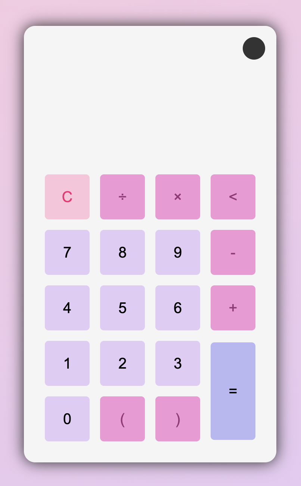
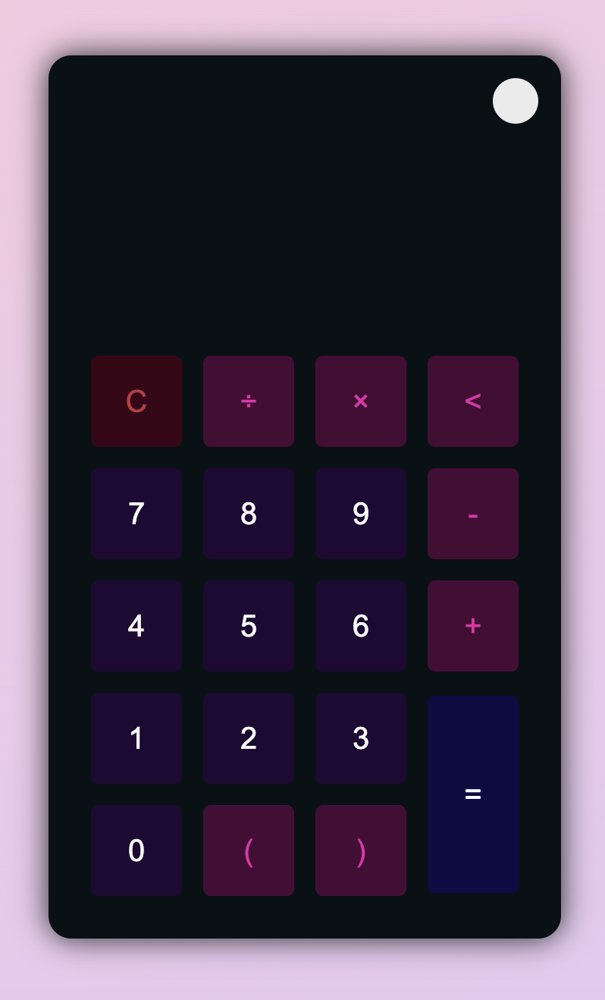

# simple-calculator

### Quick Overview

Created this simple calculator with a light and dark mode using HTML, CSS, and JS. I was interested in learning how to make a light and dark mode feature so I thought following a similar calculator project would help. [Codepen preview here](https://codepen.io/ariishaat/pen/OJEKGpr)

<table align=center>
  <tr>
    <td>
      
<b>Light mode</b>

      
    </td>
    <td>
      
<b>Dark mode</b>

      
    </td>
   </tr> 
  </td>
  </tr>
</table>

Some helpful links I used for making this:
* [Light/dark mode calculator tutorial](https://www.youtube.com/watch?v=_npnL4Gyg_o)
* [Calculator project](https://www.youtube.com/watch?v=j59qQ7YWLxw&ab_channel=WebDevSimplified)
